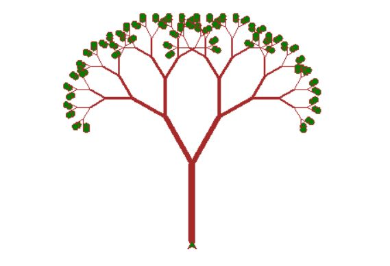
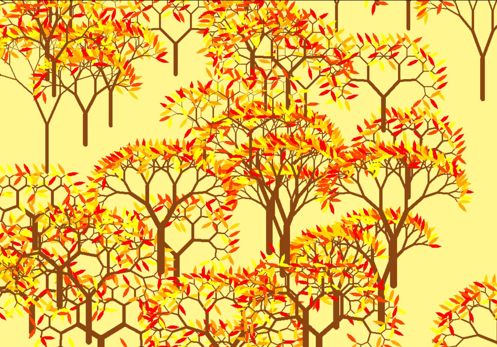

<h1 style="textalign: center; fontfamily: B titr;">عکس درخت و جنگل</h1>

 برای رسم درخت از تابع بازگشتی استفاده میکنیم یعنی یک تابع را درون خودش صدا میکنیم. در ابتدا میاییم یک تابع تعریف میکنیم که رسم تنه و دوشاخه کنارش را نشان میدهد و در نهایت دوباره تابع را صدا میکنیم

  

  

   :کد من به این صورت است

<pre>
---python
    import turtle
       def tree (d,r,t):
        if d<10 :
            turtle.fillcolor("green")
            turtle.begin_fill()
            turtle.circle(d/2)
            turtle.end_fill()
    
            
            return
       turtle.pensize(t)
        turtle.forward(d)
        turtle.left(r)
        tree (d*0.7,r, t*0.7)
        turtle.right(2*r)
        tree (d * 0.7,r, t*0.7)
        turtle.left(r)
        turtle.backward(d)
    
    
    turtle.speed(0)
    turtle.pencolor("brown")
    turtle.left(90)
    tree(90,30, 8)
    turtle.mainloop()
---    
</pre>    

