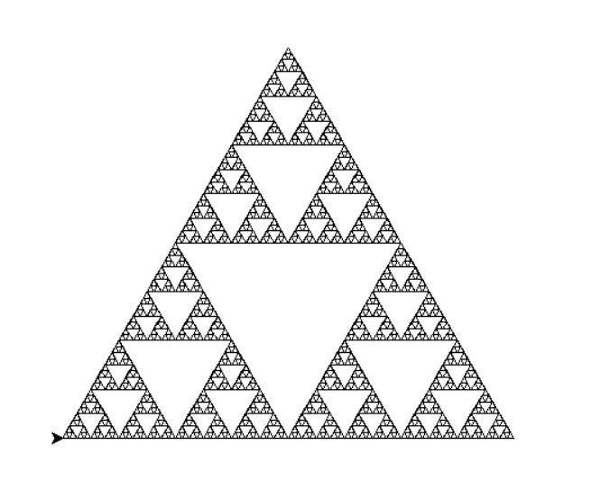

<h1 style="textalign: center; fontfamily: B titr;"> عکس فرکتال مثلث</h1>

 برای رسم این فرکتال از تابع بازگشتی استفاده میکنیم یعنی یک تابع را درون خودش صدا میزنیم تا شکل نهایی حاصل شود

  
<pre>

   import turtle

    def triangle(d):
        if d < 5:
            return    
        for _ in range(3):
            triangle(d/2)
            turtle.forward(d)
            
            turtle.left(120)
    
    turtle.tracer(0)
    turtle.speed(0)
    triangle(200)
    turtle.update()
    turtle.mainloop()

</pre>    
  
  

   