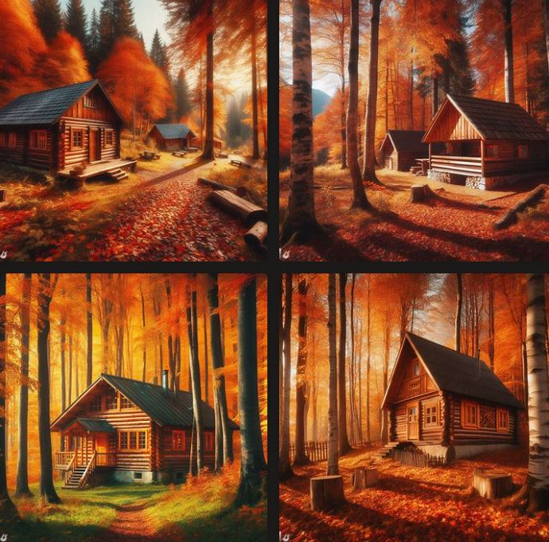

<h1 style="text-align: center; font-family:Times New Roman (Headings CS);"> Photos made with AI</h1>

On "bing.com/create", you can describe an image with words and get an impression of artificial intelligence.
In this post, I will show you what I got from AI by saying each sentence.

Wooden cabin in the autumn forest.

A wooden cabin in an autumn forest with beautiful autumn colors.

A wooden hut in the autumn forest with beautiful autumn colors next to the waterfall.

And at the end i like this image more than other.

