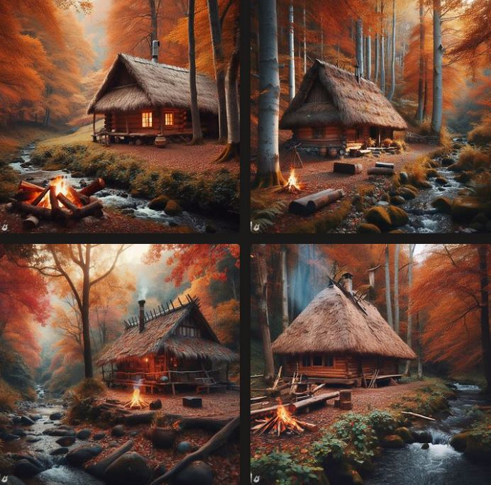

<h1 style="text-align: center; font-family:Times New Roman (Headings CS);"> Photos made with AI</h1>

 On "bing.com/create", you can describe an image with words and get an impression of artificial intelligence

In this post, I will show you what I got from AI by saying each sentence

Wooden hut in the autumn forest

A wooden cabin in an autumn forest with beautiful autumn colors

A wooden hut in the autumn forest with beautiful autumn colors next to the waterfall

And at the end i like this image more than other

